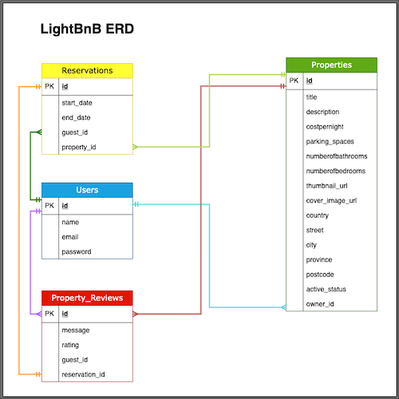
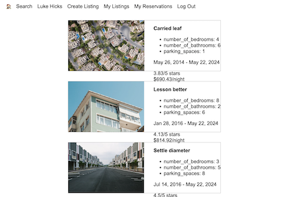
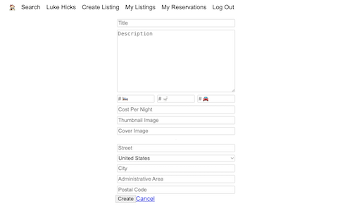
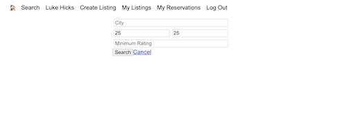

# LightBnB Project

A simple multi-page Airbnb clone that uses server-side JavaScript to display the information from queries to web pages via SQL queries.

## Getting Started

Start server:
**npm run local**

Dependencies:

- **bcrypt : ^5.1.1**
- **cookie-session : ^1.3.3**
- **express : ^4.17.1**
- **nodemon : ^3.1.0**
- **pg : ^8.11.5**

## Database ERD

## Web App Screenshots

#### Property Listings Page

#### Create Listing Page

#### Search Listing Page

